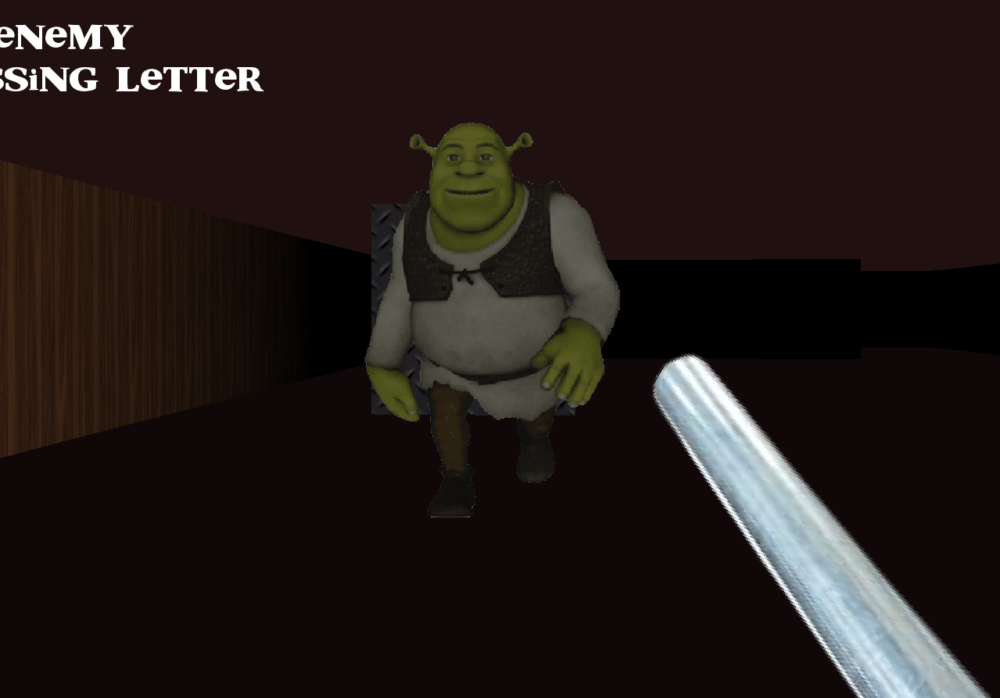

# MyRPG

Epitech first year project.

## Assignment

The goal of this project is to create a simple 2D RPG game in C with the CSFML library.

## Description

The game has a simple inventory system, a quest system and menues.

Several bonus features are implemented:

* The player can change the key bindings in the settings menu.

* The game uses a raycasting engine to render the 3D world and the player can move around the map and interact with the environment.

* An enemy AI is also implemented, and the player can fight the enemies with a simple combat system.

* Maps are also customisable, and the game can load maps from a file.

## Screenshots



## Installation

To install the game, you need to have the CSFML library installed on your computer. You can find the installation guide [here](https://www.sfml-dev.org/tutorials/2.5/start-linux.php).

Once you have the CSFML library installed, you can clone the repository and compile and run the game with the following commands:

```bash
make
./my_rpg
```
